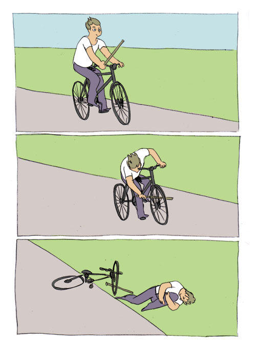

# Contest of Champions

Follow the instructions on this page, and you can become the coding champion. 
The first one gets a cool prize.

# Let's begin:

1. I was born on Sept 24 1981. How old am I? Let *AGE* be the answer in years.
2. Using the answer from above, find the *AGE*th prime number. The first prime number is 2. 
Let *PRIME* be the answer. Sum all the digits of *PRIME*. Let *SUM_PRIME* be the results of this.
3. Here is a special recursive series in which the element on position N can be written as: 
E(n) = E(n-3) + E(n-2) + E(n-1). 
The first elements are E(1)=1, E(2)=2 and E(3)=3. 
Compute the *SUM_PRIME* element in this series. Let *SERIES* be the result
4. In the file generate.c there is a function called generate that returns a binary search tree. 
Call this function with *SUM_PRIME*. 
Iterate over the left hand side of this tree that was generated and print the elements in descending order.  
Choose the third element value in this list. Let this be *RESULT*
5. *RESULT* % 20 is the index in the meme list (starting from 0 top left, going left to right first and then line by line)

## The Meme List
|                              |                              |                              |                              |
|:----------------------------:|:----------------------------:|:----------------------------:|:----------------------------:|
|    |    |    |    |
|    |    |    |    |
|    |  |  |  |
|   |  |  |  |
|  |  |  |   |
